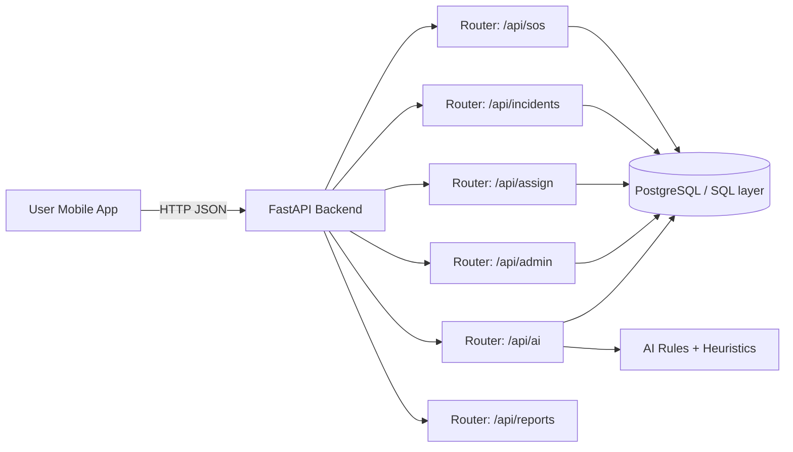

# CrisisLink-AI Platform

CrisisLink-AI is an emergency response platform that combines a Flutter client and a FastAPI backend to capture SOS reports, cluster nearby incidents, prioritize response urgency, and assist dispatch teams with AI-supported recommendations.

## Table of Contents

- [1. Business Context](#1-business-context)
- [2. Core Architecture and Innovations](#2-core-architecture-and-innovations)
- [3. System Design](#3-system-design)
- [4. Technology Stack](#4-technology-stack)
- [5. Repository Structure](#5-repository-structure)
- [6. Installation](#6-installation)
- [7. Operation Runbook](#7-operation-runbook)
- [8. API Surface](#8-api-surface)
- [9. Testing and Quality](#9-testing-and-quality)
- [10. Security and Compliance Notes](#10-security-and-compliance-notes)
- [11. Known Constraints and Improvement Backlog](#11-known-constraints-and-improvement-backlog)

## 1. Business Context

Emergency call centers receive bursts of unstructured reports during high-pressure events. CrisisLink-AI addresses this by:

- Consolidating duplicate location-based SOS reports into unified incident records.
- Tracking unique reporters to estimate incident confidence and urgency.
- Guiding dispatch teams using AI-supported suggestions and fraud-risk signals.
- Providing role-oriented mobile experiences for citizens, responders, and admins.

## 2. Core Architecture and Innovations

### 2.1 High-Level Components

1. **Flutter Client (`crisislink_ai_app`)**
   - Multi-screen emergency workflow for report intake and role-based dashboards.
   - Uses connectivity and location services to support real-time and offline-aware behavior.
   - Communicates with backend through HTTP APIs.

2. **FastAPI Backend (`backend_python`)**
   - Exposes REST endpoints for SOS, incident lifecycle, assignments, admin insights, and AI analysis.
   - Uses SQLAlchemy sessions with PostgreSQL-compatible connectivity.
   - Encapsulates AI logic for priority prediction, recommendations, and suspicious pattern checks.

3. **Relational Data Layer**
   - Core entities include incidents, reports, and responders.
   - Incident state transitions (active -> in-progress -> resolved) support operations workflow.

### 2.2 Architectural Innovations

- **Incident clustering at intake time:** incoming SOS requests are matched to nearby active incidents using coordinate proximity logic to reduce duplicate incident creation.
- **Priority escalation from crowd signals:** unique reporter counts are transformed into priority levels (`LOW`, `MEDIUM`, `HIGH`, `CRITICAL`).
- **Actionable AI recommendations:** responders and control rooms receive incident-type-specific suggestions (team/equipment/escalation hints).
- **Fraud-risk heuristics:** suspicious reporting patterns are flagged for manual triage.
- **Modular API segmentation:** business capabilities are split across dedicated routers (`sos`, `assign`, `ai`, `incident`, `admin`, `report`) for maintainability.

## 3. System Design

### 3.1 Logical Flow

1. Citizen submits SOS from mobile app.
2. Backend validates payload and finds nearby active incident.
3. If found, request is attached as report; otherwise, a new incident is opened.
4. Duplicate reports from the same phone number for the same incident are ignored.
5. Unique reporter count is recalculated and mapped to updated priority.
6. Dispatch/admin modules query active incidents and assign responders.
7. AI analysis endpoint generates recommendations and fraud-risk signals.

### 3.2 Component Interaction Diagram



### 3.3 Data and Domain Model (Operational)

- **Incident**
  - Location, type, status, priority, unique reporter count.
- **Report**
  - Incident reference, phone number, report type, timestamp.
- **Responder**
  - Availability status, category/type, last location, current incident binding.

## 4. Technology Stack

### 4.1 Client

- Flutter / Dart (SDK constraint in app configuration).
- Core packages: `geolocator`, `flutter_map`, `latlong2`, `http`, `shared_preferences`.

### 4.2 Backend

- FastAPI + Uvicorn.
- SQLAlchemy + psycopg2.
- Pydantic and pydantic-settings.
- Pytest for integration and API workflow testing.

### 4.3 Platforms

- Flutter targets: Android, iOS, macOS, Linux, Windows, Web (project scaffolds included).

## 5. Repository Structure

```text
CrisisLink-AI/
|-- crisislink_ai_app/
|   |-- lib/
|   |   |-- main.dart
|   |   |-- app.dart
|   |   |-- screens/
|   |   |-- services/
|   |   |-- widgets/
|   |   `-- utils/
|   |-- test/
|   |-- android/ ios/ macos/ linux/ windows/ web/
|   `-- pubspec.yaml
|
`-- backend_python/
    |-- app/
    |   |-- main.py
    |   |-- api/
    |   |-- ai/
    |   |-- db/
    |   |-- config/
    |   |-- services/
    |   |-- schemas/
    |   `-- utils/
    |-- tests/
    |-- requirements.txt
    `-- pytest.ini
```

## 6. Installation

## 6.1 Prerequisites

- Flutter SDK (stable channel recommended).
- Python 3.10+.
- PostgreSQL-compatible database (or Supabase-backed Postgres).

## 6.2 Backend Setup

From `backend_python`:

```bash
python -m venv .venv
source .venv/bin/activate  # Windows PowerShell: .venv\Scripts\Activate.ps1
pip install -r requirements.txt
```

Create `.env` in `backend_python`:

```env
DATABASE_URL=postgresql://<user>:<password>@<host>:<port>/<database>
```

Run backend:

```bash
uvicorn app.main:app --reload --host 127.0.0.1 --port 8000
```

## 6.3 Flutter App Setup

From `crisislink_ai_app`:

```bash
flutter pub get
flutter run
```

For production build examples:

```bash
flutter build apk
flutter build windows
```

## 7. Operation Runbook

### 7.1 Start-Up Sequence (Local)

1. Start backend API service.
2. Verify health endpoint: `GET /`.
3. Launch Flutter app target (emulator/device/desktop).
4. Perform smoke tests on SOS creation and incident visibility.

### 7.2 Standard Operational Checks

- Confirm API availability and response times.
- Validate DB connectivity (`SELECT 1` via backend DB utility path).
- Confirm incident count updates when new SOS requests arrive.
- Verify responder assignment and release lifecycle.

### 7.3 Incident Operations Lifecycle

1. Intake: SOS request enters system.
2. Correlation: report is linked or new incident created.
3. Prioritization: unique reporters recalculated and mapped.
4. Dispatch: responder assignment endpoint called.
5. Resolution: incident set to resolved via admin workflow.

## 8. API Surface

Base URL (local): `http://127.0.0.1:8000`

Mounted routers:

- `/api/sos`
  - `POST /create`
- `/api/admin`
  - `GET /stats`
  - `GET /live-incidents`
  - `POST /resolve/{incident_id}`
- `/api/ai`
  - `GET /analyze/{incident_id}`
  - `POST /predict-text`
- `/api/assign`
  - `POST /to-incident`
  - `GET /nearby-responders`
  - `POST /release/{responder_id}`
- `/api/incidents`
  - `GET /active`
  - `GET /{incident_id}`
- `/api/reports`
  - `GET /incident/{incident_id}`
  - `GET /user/{phone_number}`

Interactive docs:

- Swagger UI: `http://127.0.0.1:8000/docs`
- ReDoc: `http://127.0.0.1:8000/redoc`

## 9. Testing and Quality

Backend tests:

```bash
cd backend_python
python -m pytest tests -v
```

Flutter tests:

```bash
cd crisislink_ai_app
flutter test
```

Recommended CI gates:

- Unit and integration tests.
- Static checks (`flutter analyze`, Python linting).
- API contract validation for critical endpoints.

## 10. Security and Compliance Notes

- Do not commit `.env` or secret credentials.
- Restrict CORS origins per environment before production go-live.
- Implement API authentication/authorization for admin and assignment endpoints.
- Apply database least-privilege roles for service users.
- Add audit trails for incident state transitions in regulated deployments.

## 11. Known Constraints and Improvement Backlog

- API contract typing can be further strengthened by using Pydantic schemas directly in router function signatures.
- AI text prediction input handling should align data shape expectations for production-grade NLP behavior.
- Geospatial matching can be upgraded from bounding-box approximation to true radius-based or PostGIS indexing.
- Add observability stack (metrics, tracing, alerting) for enterprise SLA operations.

## Ownership and Contribution

This repository is intended for controlled development and deployment within an emergency response product lifecycle. For team contribution standards, maintain branch-based workflows, peer review, and environment-specific release approvals.
