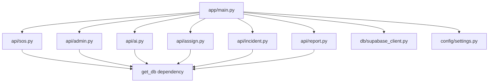

# CrisisLink-AI backend: file-by-file guide

This document describes every meaningful source file under `backend_python/`. Generated bytecode (`__pycache__/`), pytest cache (`.pytest_cache/`), and the local SQLite test database (`pytest_backend_test.sqlite3`) are omitted.

## How the app is wired



Only the six routers under `app/api/` are mounted in `app/main.py`. Several modules in `services/`, `schemas/`, and `app/utils/distance.py` exist for reuse or future tightening of the API; not all are referenced by those routers.

**Mounted URL prefixes** (from `main.py`):

| Router   | Prefix            |
|----------|-------------------|
| `sos`    | `/api/sos`        |
| `admin`  | `/api/admin`      |
| `ai`     | `/api/ai`         |
| `assign` | `/api/assign`     |
| `incident` | `/api/incidents` |
| `report` | `/api/reports`    |

---

## Root / project metadata

| File | Role |
|------|------|
| `requirements.txt` | Pinned Python dependencies (FastAPI, Uvicorn, Pydantic, SQLAlchemy, psycopg2-binary, httpx, etc.) plus **pytest** for automated tests. |
| `pytest.ini` | Pytest config: adds project root to `pythonpath` and sets `testpaths = tests`. |
| `.gitignore` | Ignores secrets (`.env`) and local SQLite test DB (`pytest_backend_test.sqlite3`). |

---

## Application entry

| File | Role |
|------|------|
| `app/main.py` | **FastAPI application**: runs `Base.metadata.create_all` on startup (no ORM models are defined under `Base` today, so this does not create tables from code), configures CORS, registers a global exception handler returning JSON 500s, mounts all API routers under `/api/...`, and exposes `GET /` with project name, version, and status. Can run Uvicorn via `python -m app.main`. |

---

## Configuration

| File | Role |
|------|------|
| `app/config/settings.py` | **Pydantic `BaseSettings`**: loads `.env`, exposes `PROJECT_NAME`, `PROJECT_VERSION`, `DATABASE_URL`, `CLUSTERING_RADIUS`, and `API_KEY_NAME`. Used by `main.py` for API title and version metadata. |

---

## Database

| File | Role |
|------|------|
| `app/db/supabase_client.py` | Reads `DATABASE_URL`, rewrites `postgresql://` to `postgresql+psycopg2://` for SQLAlchemy, creates the **engine** and **SessionLocal**, defines declarative **Base**, and **`get_db()`** for FastAPI dependency injection. Includes a `__main__` block to run `SELECT 1` as a manual connection check. |

---

## HTTP API routers (`app/api/`)

These define the live HTTP surface (prefixes in the table above).

| File | Role |
|------|------|
| `app/api/sos.py` | **`POST /create`** (under `/api/sos`): validates SOS JSON (`latitude`, `longitude`, `phone_number`, `type`), finds or creates a nearby **active** incident (~1 km via SQL bounding box), deduplicates **reports** by phone per incident, recomputes priority with `predict_priority`, updates the incident row. Imports `is_within_radius` from `distance.py` but **does not call it**; proximity is implemented only in SQL (dead import unless used later). |
| `app/api/admin.py` | **`GET /stats`**, **`GET /live-incidents`**, **`POST /resolve/{incident_id}`**: dashboard aggregates (PostgreSQL-style `COUNT(*) FILTER` on `stats`), sorted live incident list, and marking an incident resolved. |
| `app/api/ai.py` | **`GET /analyze/{incident_id}`**: loads incident and reports, runs priority prediction, suggestion engine, and fraud check. Returns 400 if there are no reports. **`POST /predict-text`**: passes free text into `predict_type` (see note under `type_prediction.py`). |
| `app/api/assign.py` | **`POST /to-incident`**, **`GET /nearby-responders`**, **`POST /release/{responder_id}`**: assigns a responder to an incident (updates `responders` and `incidents`), lists nearby active responders by type and coarse lat/lng window, releases a responder back to active. |
| `app/api/incident.py` | **`GET /active`**, **`GET /{incident_id}`**: lists active incidents and returns one incident with its reports (404 if missing). |
| `app/api/report.py` | **`GET /incident/{incident_id}`**, **`GET /user/{phone_number}`**: reports for one incident (empty shape `{"msg", "data"}` when none) and cross-incident history for a phone number. |

---

## AI logic (`app/ai/`)

| File | Role |
|------|------|
| `app/ai/priority_prediction.py` | **`predict_priority(unique_count)`**: maps distinct reporter count to `LOW`, `MEDIUM`, `HIGH`, or `CRITICAL`. |
| `app/ai/fraud_detection.py` | **`check_for_fraud(...)`**: flags suspicious patterns (e.g. impossible movement speed from timestamps and coordinates, or many reports). Coerces string timestamps from the DB to `datetime` when needed. |
| `app/ai/suggestion_engine.py` | **`get_incident_suggestions(incident_type, unique_count, priority)`**: returns a dict describing suggested team type, equipment, unit count, and escalation text based on type and load. |
| `app/ai/type_prediction.py` | **`predict_type(report_list)`**: intended to use `Counter` over a **list of report type strings** (ties broken using a fixed priority order). **`/predict-text` passes a single string**; until refactored, that behaves like iterating over characters, not keywords—callers should align input shape with this function or split text into tokens/types upstream. |

---

## Services (`app/services/`)

| File | Role |
|------|------|
| `app/services/report_service.py` | **`get_reports_summary`**, **`check_user_reputation`**: SQL helpers for report types per incident and false-alarm-style reputation. Not used by `api/sos.py` (which uses inline SQL). |
| `app/services/assignment_service.py` | **`assign_responder_to_incident`**, **`release_responder_service`**: transactional assign/release with availability checks. **Not** used by `api/assign.py`, which duplicates similar logic with inline SQL. |
| `app/services/sos_service.py` | Alternate SOS pipeline (fraud check, nearby incident, `add_new_report`). **`add_new_report` is imported from `report_service` but is not defined there**—this module is **broken if imported**; the live SOS path is `api/sos.py`. |
| `app/services/clustering_service.py` | **`is_location`**, **`get_cluster`**: helpers for proximity and centroid. **`is_location` calls `abs(lat1, lat2)`**, which is invalid for the built-in `abs` (single argument only)—not used by mounted routers. |

---

## Pydantic schemas (`app/schemas/`)

Structured request/response models. **Routers today mostly accept `dict` or primitives and use raw SQL**, so these files are optional for runtime and useful for future API contracts or OpenAPI accuracy.

| File | Role |
|------|------|
| `app/schemas/incident_schema.py` | `IncidentBase`, `IncidentCreate`, `IncidentUpdate`, `IncidentResponse`, `IncidentListResponse` (UUIDs, validated status/type/priority patterns). |
| `app/schemas/sos_schema.py` | `SOSCreate` (coordinates, phone with regex validator, type pattern) and `SOSResponse`. |
| `app/schemas/assign_schema.py` | `AssignmentRequest`, `ResponderNearbyRequest`, `AssignmentResponse` (UUID-based IDs). |

---

## Utilities (`app/utils/`)

| File | Role |
|------|------|
| `app/utils/constants.py` | String constants for incident status, incident type, priority levels, responder status, and numeric thresholds (e.g. clustering radius in degrees, fraud-related limits). |
| `app/utils/helpers.py` | Helpers: UUID string, timestamp formatting, priority-to-color mapping, phone digit sanitization, simple heuristic `calculate_priority_score`. |
| `app/utils/distance.py` | **Haversine** distance in km and **`is_within_radius`**. Exported for possible use from SOS; currently **only imported, not used**, in `api/sos.py`. |

---

## Tests (`tests/`)

| File | Role |
|------|------|
| `tests/conftest.py` | Sets `DATABASE_URL` to a project-local SQLite file before importing the app, creates minimal `incidents` / `reports` / `responders` DDL, and **clears all three tables before each test** so cases stay isolated. |
| `tests/test_backend.py` | **Integration tests** using Starlette `TestClient` against the full FastAPI app: root, incidents, reports, admin, AI (analyze and predict-text), assign flow, and SOS validation and happy path. |

---

## Running tests

From `backend_python`:

```bash
python -m pytest tests -v
```

Ensure dependencies are installed (`pip install -r requirements.txt` or a minimal set including FastAPI, SQLAlchemy, pytest, etc.). On some Python versions, `psycopg2-binary` may require a matching wheel or build toolchain; tests use SQLite only.

---

## Files you can skip (unless you want exhaustiveness)

- **`__pycache__/*.pyc`**: compiled bytecode.
- **`.pytest_cache/`**: pytest’s local cache (including files such as README or `.gitignore` inside that folder).
- **`pytest_backend_test.sqlite3`**: disposable SQLite file created during tests.
